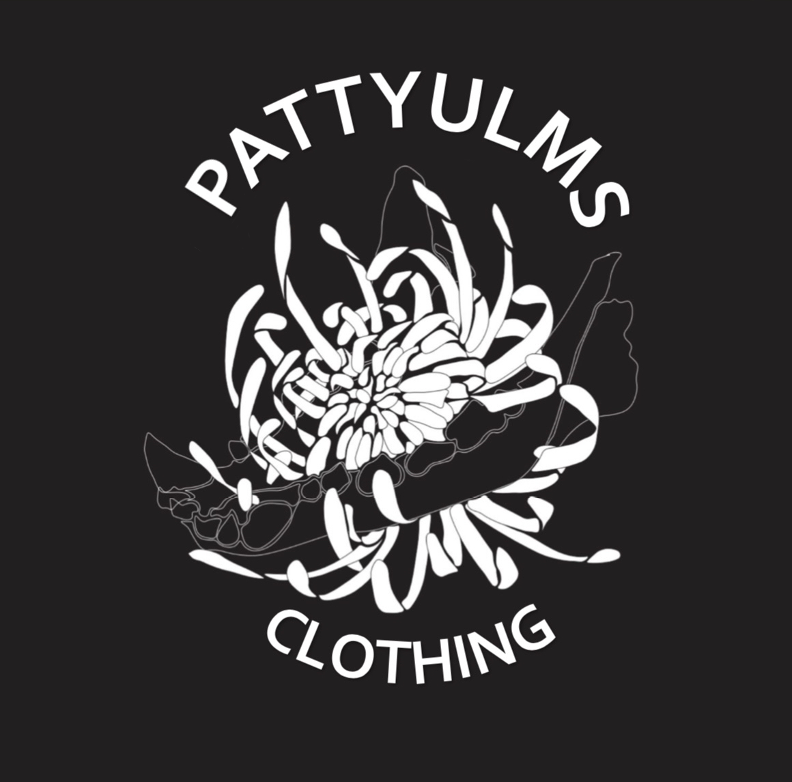

# PATTYULMS

### Ecommerce Application

Pattyulms is a web application clothing storefront featuring items such as hoodies and crewnecks. For both men and women (or whoever), Pattyulms combines clothing, concepts, art and technology all in one place.The purpose of the web application is to elevate handmade clothing.

### Whats the purpose of PATTYULMS?

The PATTYULMS Development team has been creating handmade clothind, prints and designs since 8th grade. Patrick Ulmer, the lead on PATTYULMS has a love for custom, currated, and quality clothing.

## Tech Stack

- Spring Boot
- React.js (Bootstrap)
- Mongo DB
- AWS S3 Bucket
- Axios
- Stripe API
- Uptime Robot
- Clo3D

## Things I learned

The PATTYULMS project was filled with learning. Everystep of the way was filled with learning opportunities and new things to try.
In attempt to organize the things I learned, please refer below.

### React

React.js was chosen because it is an application I knew nothing about. Additionally I have never used React Hooks, props, and a more "Loosly" handled architecture.

---

### Spring Boot

Spring Boot was chosen because PATTYULMS team has used Spring boot before.

---

### Mongo & AWS S3 Bucket

Mongo is a non relational relational database that holds all the data for the application
AWS s3 bucket holds the actual image and the link is attached to the mongo object in the database.
This was chosen because I research Grid fs, a mongo solution to storing images. However The development team decided to refuse grid fs because they researched that when adding large images, grid fs slows over time.

---Please see Sprint BackLog Template for all requirements with PATTYULMS

## Nonfunctional Requirements

### Uptime Robot

- Uptime Robot is a very simple and easy way to star monitoring a live site. We can add the url to the website and set how often we would like to ping our endpoint. We will get an alert if the PATTYULMS site is down.
- Uptime robot was not implemented as of 4-30 because cloud development has not been complete.
---

### Logging

- Logging is an important function when it comes to this E-commerce site. With Logging implimented in PATTYULMS, the development team can trace the user lifecycle. This is important because if there are any issues, the Dev team knows where and how it occured. Additionally the team can see which items the users are looking at the most.

---

## Sitemap

## Wireframe

## Aknowledgements

Thank you to GCU and the amazing developers and teachers who have taught and helped me along the way!
People who have helped the PATTYULMS project directly

- Professor Reha
- Noah Roerig
- Arin Ahara
- Jack Blackwell
